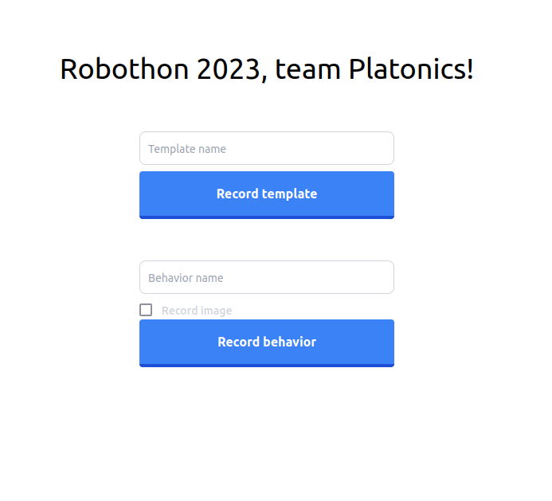

# Robothon gui

This repo contains a plain html, css and javascript Graphical User Interface for the Robothon 2023 challenge. It uses a flask api written in python as backend.

To install the python dependencies for this GUI we're using poetry:
```bash
poetry install
```

To run the server for the GUI run the following:
```bash
flask --app gui_backend run
```

To display the GUI, open your browser and go to: `localhost:5000`

